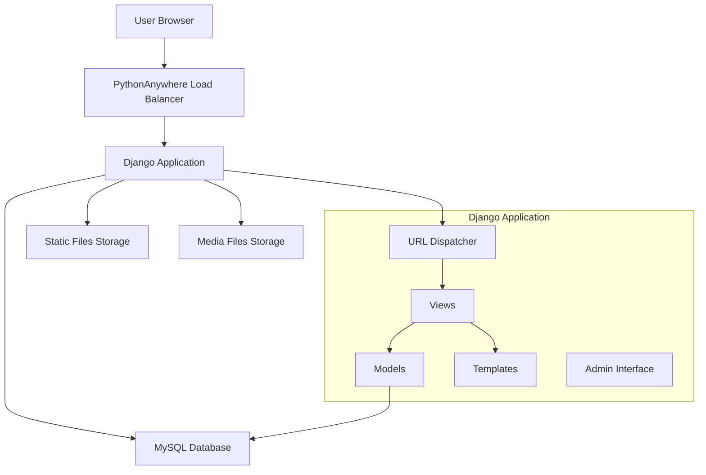
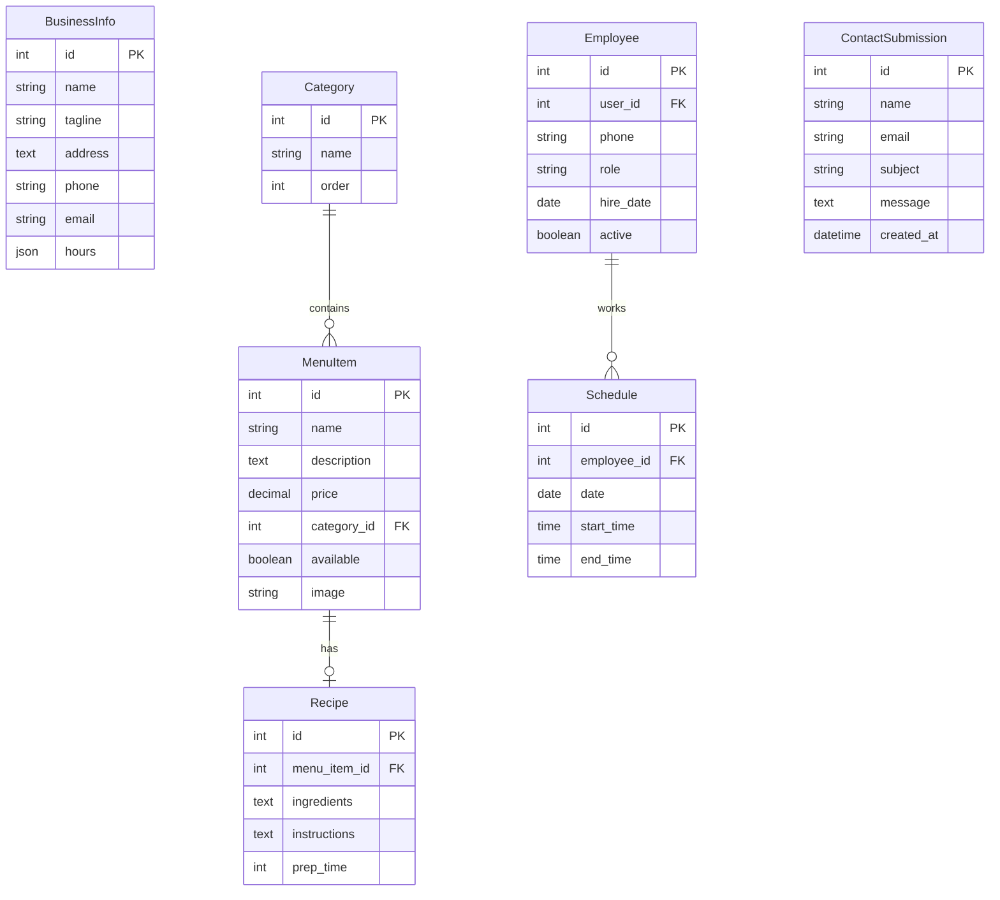

# White Raven Pourhouse Website - Technical Design

## Overview
This document outlines the technical architecture for the White Raven Pourhouse Django website, optimized for deployment on PythonAnywhere's free tier with MySQL database. The design emphasizes simplicity, maintainability, and cost-effectiveness while providing all required functionality for a small coffee shop.

## Code Reuse Analysis
**Initial Project**: Starting from scratch with Django best practices
- **Django Framework**: Latest stable version (5.x)
- **Admin Interface**: Leverage Django's built-in admin with customizations
- **Authentication**: Use Django's user authentication system
- **Forms**: Django forms with Bootstrap styling
- **Templates**: Django template inheritance with Bootstrap components

## Architecture

### System Architecture


### Project Structure
```
white_raven_pourhouse/
├── manage.py
├── requirements.txt
├── static/
│   ├── css/
│   ├── js/
│   └── images/
├── media/
│   └── uploads/
├── templates/
│   ├── base.html
│   ├── home.html
│   ├── menu.html
│   ├── contact.html
│   └── admin/
├── white_raven_pourhouse/
│   ├── __init__.py
│   ├── settings.py
│   ├── urls.py
│   └── wsgi.py
├── core/
│   ├── models.py
│   ├── views.py
│   ├── admin.py
│   ├── forms.py
│   └── urls.py
├── menu/
│   ├── models.py
│   ├── views.py
│   ├── admin.py
│   └── urls.py
└── staff/
    ├── models.py
    ├── views.py
    ├── admin.py
    └── urls.py
```

## Components and Interfaces

### Django Apps Structure

#### 1. Core App
**Purpose**: Main website functionality and shared components
- **Models**: Business info, contact forms, site settings
- **Views**: Homepage, about, contact, location
- **Templates**: Base templates, static pages

#### 2. Menu App  
**Purpose**: Menu items and recipe management
- **Models**: Categories, MenuItems, Recipes, Ingredients
- **Views**: Public menu display, admin menu management
- **Admin**: Custom admin for menu management

#### 3. Staff App
**Purpose**: Employee and schedule management
- **Models**: Employee, Schedule, Role
- **Views**: Staff admin views (admin-only)
- **Admin**: Staff management interface

### Key Models Design

#### Core Models
```python
# core/models.py
class BusinessInfo(models.Model):
    name = models.CharField(max_length=100)
    tagline = models.CharField(max_length=200)
    address = models.TextField()
    phone = models.CharField(max_length=20)
    email = models.EmailField()
    hours = models.JSONField()  # Store operating hours
    
class ContactSubmission(models.Model):
    name = models.CharField(max_length=100)
    email = models.EmailField()
    subject = models.CharField(max_length=200)
    message = models.TextField()
    created_at = models.DateTimeField(auto_now_add=True)
```

#### Menu Models
```python
# menu/models.py
class Category(models.Model):
    name = models.CharField(max_length=50)
    order = models.PositiveIntegerField(default=0)
    
class MenuItem(models.Model):
    name = models.CharField(max_length=100)
    description = models.TextField()
    price = models.DecimalField(max_digits=6, decimal_places=2)
    category = models.ForeignKey(Category, on_delete=models.CASCADE)
    available = models.BooleanField(default=True)
    image = models.ImageField(upload_to='menu/', blank=True)
    
class Recipe(models.Model):
    menu_item = models.OneToOneField(MenuItem, on_delete=models.CASCADE)
    ingredients = models.TextField()
    instructions = models.TextField()
    prep_time = models.PositiveIntegerField(help_text="Minutes")
```

#### Staff Models
```python
# staff/models.py
class Employee(models.Model):
    user = models.OneToOneField(User, on_delete=models.CASCADE)
    phone = models.CharField(max_length=20)
    role = models.CharField(max_length=50)
    hire_date = models.DateField()
    active = models.BooleanField(default=True)
    
class Schedule(models.Model):
    employee = models.ForeignKey(Employee, on_delete=models.CASCADE)
    date = models.DateField()
    start_time = models.TimeField()
    end_time = models.TimeField()
```

## Data Models

### Database Schema


## User Interface Design

### Frontend Framework
- **Bootstrap 5**: Responsive CSS framework
- **Django Templates**: Server-side rendering
- **Minimal JavaScript**: Progressive enhancement
- **Mobile-first**: Responsive design approach

### Template Hierarchy
```
base.html
├── home.html (landing page)
├── menu.html (public menu)
├── contact.html (contact form)
├── location.html (hours, map, directions)
└── admin/ (customized admin templates)
```

### Key Pages Design

#### Homepage
- Hero section with business name and tagline
- Featured menu items
- Business hours and location summary
- Instagram feed integration (optional)
- Call-to-action buttons

#### Menu Page
- Category-based organization
- Item cards with image, description, price
- Filter by category
- Mobile-optimized layout

#### Admin Dashboard
- Custom admin home with business metrics
- Quick access to menu, staff, and content management
- Recently submitted contact forms
- Business info editing

## Error Handling

### Error Strategy
- **User-friendly error pages**: Custom 404, 500 templates
- **Form validation**: Django forms with Bootstrap styling
- **Admin notifications**: Email alerts for contact forms
- **Logging**: Django logging for debugging
- **Graceful degradation**: Site works without JavaScript

### Error Templates
- `404.html`: Page not found with navigation
- `500.html`: Server error with contact information
- Form errors displayed inline with Bootstrap styling

## Testing Strategy

### Testing Approach
- **Django TestCase**: Model and view testing
- **Factory Boy**: Test data generation
- **Coverage.py**: Test coverage measurement
- **Manual testing**: Admin interface functionality
- **Browser testing**: Cross-device compatibility

### Test Categories
1. **Model tests**: Data validation, relationships
2. **View tests**: Response codes, template usage
3. **Form tests**: Validation, submission handling
4. **Admin tests**: Custom admin functionality
5. **Integration tests**: End-to-end workflows

## Security Implementation

### Security Measures
- **HTTPS**: Enforced in production settings
- **CSRF protection**: Django's built-in CSRF tokens
- **SQL injection**: Django ORM prevents SQL injection
- **XSS protection**: Template auto-escaping enabled
- **Admin security**: Strong passwords, session timeouts
- **File uploads**: Restricted file types, size limits

### Django Security Settings
```python
# Security settings for production
SECURE_BROWSER_XSS_FILTER = True
SECURE_CONTENT_TYPE_NOSNIFF = True
X_FRAME_OPTIONS = 'DENY'
SECURE_HSTS_SECONDS = 31536000
SECURE_HSTS_INCLUDE_SUBDOMAINS = True
```

## Deployment Configuration

### PythonAnywhere Deployment
- **WSGI**: Django WSGI application
- **Static files**: Collected and served by PythonAnywhere
- **Database**: MySQL with proper connection settings
- **Environment variables**: Sensitive settings stored securely
- **Domain**: Custom domain configuration

### Settings Configuration
```python
# settings.py structure
DATABASES = {
    'default': {
        'ENGINE': 'django.db.backends.mysql',
        'NAME': 'username$database_name',
        'USER': 'username',
        'PASSWORD': os.environ.get('DB_PASSWORD'),
        'HOST': 'username.mysql.pythonanywhere-services.com',
    }
}

STATIC_URL = '/static/'
STATIC_ROOT = '/home/username/static/'
MEDIA_URL = '/media/'
MEDIA_ROOT = '/home/username/media/'
```

## Performance Optimization

### Performance Strategy
- **Database optimization**: Efficient queries, select_related
- **Static file optimization**: Compressed CSS/JS
- **Image optimization**: Automatic resizing for menu items
- **Caching**: Django's cache framework for static content
- **CDN**: PythonAnywhere's static file serving

### Optimization Techniques
1. **Database**: Use Django ORM efficiently
2. **Templates**: Minimize database queries in templates
3. **Images**: PIL for automatic image processing
4. **CSS/JS**: Minification and compression
5. **HTTP**: Proper cache headers

## Monitoring and Maintenance

### Monitoring Approach
- **Django admin**: Business metrics dashboard
- **PythonAnywhere logs**: Error monitoring
- **Contact form**: Email notifications
- **Manual monitoring**: Regular site checks

### Maintenance Tasks
1. **Database backup**: Regular MySQL backups
2. **Security updates**: Django and dependency updates
3. **Content updates**: Menu and business info maintenance
4. **Performance monitoring**: Site speed and uptime checks

## Technical Stack Summary

- **Backend**: Django 5.x (Python web framework)
- **Database**: MySQL (PythonAnywhere free tier)
- **Frontend**: Bootstrap 5 + Django templates
- **Hosting**: PythonAnywhere free tier
- **Domain**: Custom domain support
- **SSL**: Let's Encrypt (included)
- **File storage**: PythonAnywhere file system
- **Version control**: Git repository
- **Deployment**: Manual deployment via PythonAnywhere console

This design provides a solid foundation for the White Raven Pourhouse website that can be implemented efficiently and scaled as the business grows.